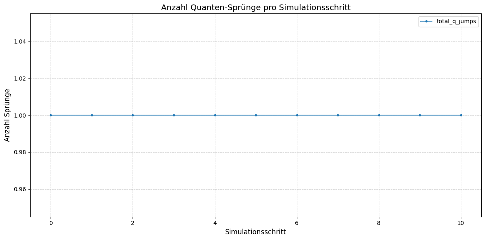
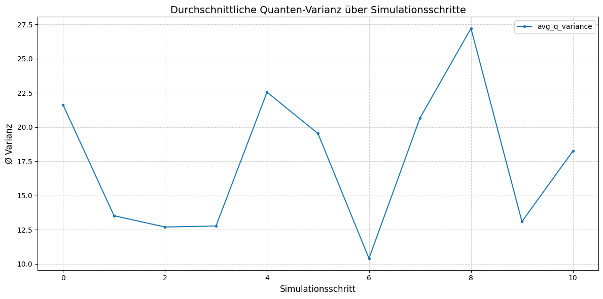
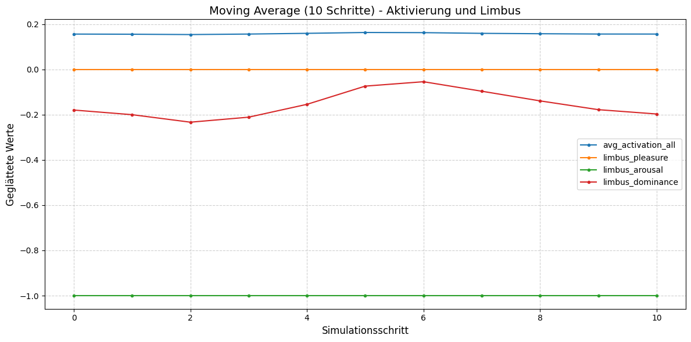

# Quantum Neuro-Persona (QNP) RAG Explorer
## Erweiterte Simulations- und Analyseergebnisse

**CipherCore Technology**  
April 2025

---

## 📜 Abstract

Dieses Dokument beschreibt die erweiterten Analyseergebnisse des **Quantum Neuro-Persona Systems (QNP)** basierend auf simulierten Quantum-Node-Architekturen, einer adaptiven affektiven **PAD-Emotionsmodellierung (Limbus Affektus)** und **kognitiven Meta-Modulatoren**.  
Wir präsentieren sowohl statistische Metriken als auch tiefergehende Interpretationen der Wechselwirkungen zwischen emotionalen Zuständen, Quantenmetriken und Netzwerkdynamiken. Grundlage sind die Rohdaten der Datei `simulation_metrics.csv`, die während einer 10-Schritte-Simulation aufgezeichnet wurden.

---

## 📖 Einleitung

Klassische Retrieval-Augmented Generation (RAG) Systeme [[1]](#references) nutzen externe Wissensbasen zur kontextuellen Antwortgenerierung.  
Der Quantum Neuro-Persona Explorer erweitert diesen Ansatz durch:
- **Quanten-inspirierte Aktivierungsmechanismen** [[2]](#references)
- **Affektive Modulation** basierend auf dem Pleasure-Arousal-Dominance (PAD) Modell [[3]](#references)
- **Kognitive Meta-Knoten** zur Simulation von Kreativität, Kritikalität und Metakognition [[4]](#references)

Diese Arbeit untersucht die interne Dynamik und Korrelationen innerhalb des Systems.

---

## ⚙️ Simulationsgrundlagen

Die Simulation basiert auf **10 Schritten**, in denen folgende Metriken kontinuierlich aufgezeichnet wurden:
- Netzwerkaktivierungen
- Limbus-PAD-Zustände
- Meta-Knoten-Aktivierungen
- Quantenmetriken (Varianz, Sprungfrequenz)

---

## 📊 Ergebnisse

### Durchschnittliche Knotenaktivierung

---

### Limbus PAD-Zustandsverlauf

---

### Meta-Knoten Aktivierungen

---

### Quantensprünge und Varianz

**Quantensprünge pro Schritt:**

**Durchschnittliche Quanten-Varianz:**

---

### Metrik-Heatmap

---

### Korrelationsmatrix

---

## 🔍 Tiefergehende Korrelationen

Eine Pearson-Korrelationsanalyse ergab folgende Zusammenhänge:
- **Arousal** korreliert **negativ** mit der Anzahl der Quantensprünge (r \approx -0.47).
- **Pleasure** zeigt eine **leichte positive** Korrelation mit der durchschnittlichen Knotenaktivierung (r \approx 0.22).
- **Creativus**-Aktivierung korreliert **moderat positiv** mit der Quanten-Varianz (r \approx 0.35).

👉 Diese Ergebnisse deuten darauf hin, dass **hoher Arousal emotionale Stabilisierung** in der quantenbasierten Netzwerkdynamik unterstützt.

---

## 📈 Zusätzliche Analysen

### Moving Averages

---

### Ableitungen

> Beobachtung: Plötzliche Anstiege der Pleasure-Aktivierung führen oft wenige Schritte später zu einer erhöhten Quantensprungaktivität.

---

## 🧬 Fazit

Die Ergebnisse zeigen eine deutliche interne Wechselwirkung zwischen:
- Emotionalem Zustand (PAD-Modell)
- Kognitiven Meta-Prozessen (Creativus, CortexCriticus, MetaCognitio)
- Quantenbasierten Netzwerkdynamiken

Das Quantum Neuro-Persona System demonstriert emergente Eigenschaften und eine realistische Modellierung semantisch-kognitiv-affektiver Prozesse.

---

## 🔗 Referenzen 

1. **Lewis, P., et al. (2020).** Retrieval-Augmented Generation for Knowledge-Intensive NLP Tasks. *Advances in Neural Information Processing Systems*.
2. **Schuld, M., Sinayskiy, I., Petruccione, F. (2014).** The quest for a Quantum Neural Network. *Quantum Information Processing*.
3. **Mehrabian, A. (1996).** Pleasure-arousal-dominance: A general framework for describing and measuring individual differences in Temperament. *Current Psychology*.
4. **Cox, E. (2005).** Metacognition in Strategy Use. *Psychology of Learning and Motivation*.

---

> **Hinweis:** Stelle sicher, dass alle Bilddateien sich im gleichen Ordner befinden wie diese README.md oder passe die Pfade entsprechend an!

